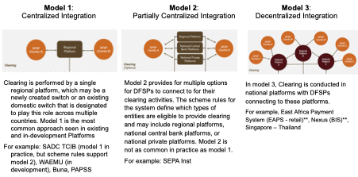

# Table of Contents

Cross border challenges

Cross border opportunities

Cross-border IIPS arrangement types

Mojaloop vision and objectives

Use cases

Unique cross-border requirements

Mojaloop designs

Clearing

Settlement

Addressing and Directories

Compliance Screening

Reporting and Information Queries

Currency Conversion

Fraud Management

Harmonization of Domestic IPS Differences

Related regulatory and scheme considerations

# Cross border challenges

Although most of the value exchanged cross-border is comprised of
large-value transactions, smaller-value, retail transactions are the
bulk of the actual payments exchanged. Low-income senders and receivers
meaningfully contribute to these high transaction volumes. However, to
date, low-income end users have had to tolerate friction and frustration
to send cross-border payments.

# Cross border opportunities

Longstanding cross-border methods (e.g., correspondent banking and money
transmitter organizations (MTOs)) are modernizing but do not solve all
low-income end user needs. This has led to targeted and timely global
policy engagement to improve cross-border transfers, particularly
remittances, led by the G20 and SDG; it has also led to new cross-border
connections through new multi-country inclusive instant payment systems
(IIPS), which broadly fall into three arrangement types: centralized,
partially centralized, and decentralized.

# Cross-border IIPS arrangement types

Multi-country IIPS arrangements generally fall into one of three
conceptual models. Variations exist in design elements within each
model:

Any IIPS integration models can theoretically be inclusive. We
anticipate that all models will coexist and interact. Similarly, we
expect Digital Financial Services Providers (DFSPs), and by proxy, their
end users, may be a part of multiple cross-border integrations.

To the extent possible, we outline a vision that is agnostic to the
arrangement type, particularly for things like DFSP liquidity and
capability requirements. However, the remaining document calls attention
to unique arrangement requirements when they exist. For example, a
decentralized model uniquely requires cross scheme considerations and
domestic IPS readiness.

# Mojaloop cross-border vision and objectives

This document, and the Mojaloop cross-border effort, establishes the
vision for how cross-border IIPS should work to ensure optimal outcomes
for low income and financially marginalised participants. Like Mojaloop
OSS for domestic IPS, this vision requires alignment with the Mojaloop
invariants and the Level One Project (i.e., immediate funds transfer,
irrevocable push payments only, non-bank participation, etc.). Our
objectives include:

1)  Maintain an end user focused- design, that meets the needs of
    low-income and women end user requirements;

2)  Allow for all use cases but prioritize use cases most critical to
    low-income and women end users – specifically P2P cross-border
    remittances and P2M cross-border Micro, Small, and Medium Enterprise
    (MSME) payments;

3)  Design a flexible, inclusive architecture that can be used for any
    cross-border arrangement type and can connect one arrangement to
    another;

4)  Solve for unique cross-border IIPS requirements

We assume the vision will be actualized by individual Mojaloop workstreams, who are responsible for OSS development.

# Use Cases

As stated above, we aim to allow for all use cases but prioritize use
cases most critical to low-income and women end users – specifically P2P
cross-border remittances and P2M cross-border Micro, Small, and Medium
Enterprise (MSME) payments. What do end users require in each of these
use cases?

- To send and receive money in their local currency, respectively

- To have visibility into total fees prior to payment initiation AND to
  choose to accept or decline the transaction as a result of those fees

- To understand when funds will exit or enter their account

- To have the transaction happen in seconds with real time funds
  availability

- To send and/or receive on any device, in any location

As we consider these requirements, we will eventually extended and
expand on them to other cross-border use cases like beneficiary
disbursements (B2P/G2P) and supplier payments (B2B), among others.

Use cases that are outside of scope are consistent with those outside of
scope for Mojaloop in a single country context, for example, voucher
payments.

# Unique cross-border IIPS requirements 

To achieve the Mojaloop goals and meet the use case requirements, a
cross-border IIPS **must** design for

Cross border clearing,

Cross border settlement,

Cross border addressing or addressing resolution,

Cross border compliance screening,

Cross-border reporting and information queries.

A cross-border IIPS **may or may not** design for

Currency conversion from one jurisdictional currency to another, and
entity(ies) type(s) that can support currency conversion (i.e., ‘Foreign
Exchange Provider’),

Harmonization or management of domestic IIPS differences (in a
decentralized arrangement).

A cross-border IIPS **supports the** implementation of

Cross border fraud management.

# Mojaloop Design

The remaining sections share Mojaloop cross-border design requirements
to drive inclusivity. For additional detail (e.g., relevant API specs),
please visit the Mojaloop repo on GitHub or reach out to a Mojaloop team
member.

# Mojaloop design: cross-border clearing

1.  The architecture applies Mojaloop clearing design choices to a
    cross-border arrangement (e.g., two-phase commit)

2.  The architecture can support:

    1.  Centralized and partially centralized arrangements whereby
        participants connect directly to a designated centralized
        platform, or

    2.  Decentralized arrangements whereby participants connect to a
        jurisdictional IPS which connect to one another.

3.  To support 1a., the overall architecture allows for, but does not
    require, a centralized platform. The regional platform can perform
    the following functions:

    1.  It can mediate the exchange of messages between participants in
        jurisdictional IPSs, and between participants in jurisdictional
        IPSs and participants in the centralized platform.

    2.  It can manage the recording and settling of obligations between
        member jurisdictional IPSs and Foreign Exchange Provider(s)
        (FXPs), if relevant

4.  The architecture can support the integration of multiple
    cross-border schemes, whereby participants connect to a
    jurisdictional IPS which is connected to a centralized platform.

5.  Participants can transact in their local currency.

6.  A Mojaloop participant is uniquely identifiable globally vis a vis a
    unique identifier or a unique identifier within a particular scheme.

7.  The overall design can support both Mojaloop and non-Mojaloop
    jurisdictional IPSs and the use of Mojaloop or non-Mojaloop
    ‘payments manager’ capabilities.

8.  The overall design supports irrevocability and immediate funds
    availability to the receiving end user.

9.  The design ensures appropriate liquidity guarantees to align with
    good funds availability requirements, as articulated by scheme(s)
    rules and relevant regulations.

10. The architecture supports the calculation of participant or
    jurisdictional IPS positions, which aggregate the transfers which
    have been cleared but not settled against the same account.

11. The design can process on-us transactions.

# Mojaloop design: cross-border settlement

1.  The architecture prioritizes local currency settlement but supports
    a single settlement currency model, as necessary.

2.  The design supports real-time gross settlement or multilateral or
    bilateral net settlement approaches.

3.  The architectures can support varying settlement models including:

    1.  Centralized settlement whereby directly connected participants
        settle with each other using the settlement method as outlined
        by a regional scheme.

    2.  Decentralized settlement whereby jurisdictional IPSs and
        participants in jurisdictional IPSs can settle using the
        settlement method of their jurisdictional IPS.

4.  The overall design ensures good funds availability in any settlement
    “account”. These funds may take the form of deposits in a bank
    account, but we do not insist on this.

5.  The overall design ensures obligations across all parties (DFSPs
    and/or jurisdictional IPSs) net to zero at each step in the process,
    satisfying the requirements of double-entry book-keeping.

6.  The design ensures that integrity of the liquidity cover process.

# Mojaloop design: cross-border addressing and directories

1.  The design supports the use of aliases, whereby the sender does not
    need to know the receivers account number in order to initiate a
    payment.

2.  The design is alias type agnostic and supports any aliases deemed
    necessary for sending and receiving payment including but not
    limited to national ID, tax ID, merchant ID, random alias, email
    address, and/or phone number.

3.  The design aims to leverage aliases that exist, if and when they are
    already assigned.

4.  The design prefers an interoperable (applicable to multiple
    cross-border arrangements) directory service to support the exchange
    of payment addressing information. The design also supports a
    centralized (within a single cross-border arrangement) approach, as
    necessary.

5.  The design supports directory response calls indicating an alias is
    a match for an account; it also supports response calls when no
    match or multiple matches are found.

6.  The design supports confirmation of payee.

7.  The design accommodates a referential (zero knowledge proof) or a
    ‘message rich’ approach.

# Mojaloop design: cross-border compliance screening 

1.  The design supports the performance of all required compliance
    checks, including sanction screening, as performed by, and required
    of DFSPs.

2.  The design ensures that any personally identifiable information
    (PII) carried in the end to end message, as necessary, is always
    encrypted.

3.  That design requires a secure database that stores only necessary
    data at rest, supported by role-based access controls.

4.  The architecture is flexible to adjust to unique country and/or
    regional regulations.

5.  The design ensures that Foreign Exchange Providers (FXPs) when party
    to a transaction, are visible to the sending and receiving DFSP.

6.  The design aims to drive down compliance costs by supporting
    compliance screening automation for DFSPs, where appropriate and
    possible.

7.  The design aligns with the addressing resolution capabilities-
    leveraging aliases, whereby account attribution is managed by the
    DFSP to decrease data risks.

8.  The design supports traceability, across all transaction parties.

9.  The design does not apply a persistence requirement to DFSPs on
    party identifiers but requires DFSPs to hold transaction identifiers
    in a manner traceable to the parties in the timeline as required by
    the regulator.

10. The design requires FXPs to support DFSP traceability needs, holding
    relevant transaction details in a traceable manner in the timeline
    as required by the regulator.

# Mojaloop design: cross-border reporting and information queries

1.  The design supports traceable money transfers.

2.  All information related to a transfer should be directly available
    for reporting.

3.  The design ensures that reporting can be done on individual
    transfers.

4.  The design supports flexible reporting needs to align with
    regulatory requirements.

5.  The data available reflects existing and collected Scheme activity.

6.  The design allows for comparative analysis such that reporting can
    showcase transaction pricing.

7.  The design provisions reconciliation support whereby appropriate
    users can disambiguate transaction information to see line by line
    trade information.

8.  Reports can share legal entity identifiers, or the equivalent unique
    identifier, associated with a transfer.

9.  The design supports role-based access controls to reports and report
    requests.

10. Data for reporting can be sorted and categorized for forensic
    purposes as it relates to transfers within the Scheme.

# Mojaloop design: cross-border currency conversion

1.  The design supports the ability to conduct a transfer where the
    sending currency is different than the receiving currency. The
    currencies in which a payee’s account(s) can receive funds is
    returned as part of the discovery process.

2.  The design supports a role - an FXP (Foreign Exchange Provider),
    which is an entity that provides currency conversion for DFSPs in a
    cross-border arrangement.

3.  The design supports but doesn’t require currency conversion in a
    cross-border transaction.

4.  An FXP can, but is not required, to be a DFSP.

5.  The design supports payee DFSP or the payer DFSP requesting currency
    conversion.

6.  The design acknowledges that currency conversion as a function is
    distinct from harmonization of regulatory regimes.

7.  The design enables a competitive FXP marketplace, whereby upon a
    currency conversion request, multiple FXPs can respond to that
    request with competing quotes. The design allows for an alternative
    approach to currency conversion quoting and servicing.

# Mojaloop design: Harmonization of domestic IIPS differences

- The design ensures the ability to accommodate Mojaloop and
  non-Mojaloop schemes.

- All design aspects can be applied to any cross-border arrangement,
  including decentralized arrangements whereby domestic IIPS’ connect
  directly.

- The design acknowledges harmonization of other aspects may be required
  to facilitate cross-border transfers (e.g. messaging protocols).

# Mojaloop design: fraud management

1.  The design assumes compliance for fraud management still lies with
    DFSPs.

2.  The design supports a traceable but privacy protected approach to
    avoid systemic attacks that can support fraud.

3.  The design considers fraud management a shared investment to support
    the betterment of the ecosystem.

4.  The design supports the implementation of a fraud and risk
    management solution that aligns with the evolving Level One Project
    Fraud Management Principles and best practices.

5.  The architecture allows for volume and value limits to support DFSP
    risk controls.

6.  The design supports mechanisms for lodging and management of fraud
    complaints and disputes.

7.  The architecture supports irrevocability, and as a result, reversals
    are not supported and requests for return of funds are only
    supported as new transactions.

8.  The design promotes safe payment-addressing, clear account naming
    conventions, and confirmation of payee as anti-fraud mechanisms.

# Related scheme and regulatory considerations 

The Mojaloop Foundation is designing technology to support inclusive
instant cross-border transfers. How that design comes to life can be
influenced by regulatory and scheme choices. Example regulatory and
scheme considerations include:

- How do we ensure appropriate KYC/AML/CFT in cross-border transfers?

  - From a regulatory standpoint, we need to ensure each country
    regulations apply appropriate AML/CFT procedures (e.g., FATF
    guidelines to stop predicate offenses).

  - From a scheme rules standpoint, we need to

    - Ensure scheme rules align with and abide by relevant regulations,

    - Ensure the scheme requires traceability, across all transfer
      parties (more specifically, the scheme should require traceability
      to align with compliance best practices),

    - Consider the ability or necessity to pause transactions,

    - Consider the ability or necessity to suspend transactions,

    - Require DFSPs to train and ensure proper record keeping,

    - Require DFSPs to abide by relevant KYC rules.

- How do we promote competition and low-cost cross-border transfers?

  - From a regulatory standpoint, we need to

    - Allow licensed banks and non-banks to play account holding
      (participant) roles and foreign exchange provider (FXP) roles,

    - Promote stakeholder engagement in the development and evolution of
      a cross-border arrangement,

    - Promote regulatory harmonization to lower barriers to entry and
      promote scale,

    - Consider other regulatory issues that can help promote competition
      and low-costs.

  - From a scheme rules standpoint, we need to

    - Develop inclusive cross-border governance models,

    - Support cost utility plus investment business models for scheme
      and platform cross-border integrations,

    - Allow licensed banks and non-banks to play account holding
      (participant) roles and foreign exchange provider (FXP) roles,

    - Ensure the functionality and development of an FXP marketplace to
      drive currency conversion costs down,

    - Support innovative settlement models that decrease necessity of
      ‘double conversion’,

    - Support the needs of compliance and fraud management requirements
      with low cost compliance solutions,

    - Require pricing transparency to end users, prior to transaction
      confirmation

    - Consider the ability to demand low end user fees for certain use
      cases,

    - Consider other scheme issues that can help promote competition and
      low-costs.

- How do we harmonize regulatory differences or manage differences
  recognizing supervisors work according to domestic laws that may vary?

  - From a regulatory standpoint, we need to

    - Understand and articulate the similarities and differences of laws
      and regulations in each arrangement jurisdiction,

    - Determine scheme and technical implications and choices that
      result from such differences.

    - Recommend harmonization choices that best align with inclusive
      principles.
